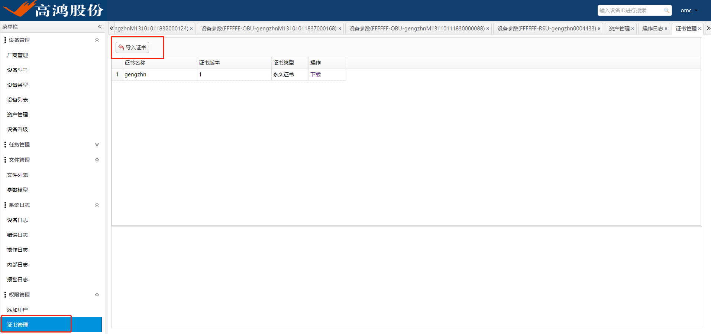

# OMC 开站操作手册

## 0. 导入权限证书

```shell
权限管理-证书管理-导入证书
```



## 1. 开站前准备

### 1.1 烧录或者升级

#### 1.1.1 线刷烧录（略）

#### 1.1.2  使用本地OM SDM工具进行开站前的烧录

```shell
1、获取SDM3000工具,终端对应的权限证书
2、关闭本地防火墙，打开SDM3000工具
3、文件管理-文件列表，上传证书
4、权限管理-证书管理，设置证书
5、设备管理-配置管理-设备列表，添加设备，点击添加，配置IP和别名
6、文件管理-文件列表，上传升级版本
7、设备管理-配置管理-设备列表，设备操作升级，等待下载烧录完成
```

### 1.2 终端侧上线前参数预配置

#### 1.2.1 必选参数check

```shell
v2x.deviceInfo.deviceSerial
# 这个参数目前是只读,默认是自动注入的，无需人工填写，假如没有填写，请直接修改/amt/sn.txt文件重启
```


```shell
v2x.obu.omProxy.acs.username
# 这个参数目前是只读,默认是自动注入的，无需人工填写，假如没有填写，直接使用SDM修改
```


```shell
v2x.obu.omProxy.acs.url
v2x.obu.omProxy.acs.acsaddr
# 这两个参数需要填写成你连接的OMC，即需要改成局域网OMC的地址
```


### 1.3 终端接入网络（使用SDM配置，使用SDM方式配置，升级之后才能继承参数）

#### 1.3.1 以太网方式接入网络：

```shell
1、配置静态IP，v2x.core.network.netDeviceList.1.ipaddr
```


```shell
2、可选，配置默认网关，网关需要在指定自启动文件内配置（/system/etc/init.d/rcS2），否则升级之后无法继承
[root@dtvl3000 ~]#cat /system/etc/init.d/rcS2
route add default gw 172.30.248.254 dev eth0
```

```shell
3、可选，配置DNS，假如需要上外网，可能需要配置DNS
[root@dtvl3000 ~]#cat /etc/resolv.conf
nameserver 119.29.29.29
nameserver 8.8.8.8
```

#### 1.3.2 以WiFi方式接入

```shell
配置如下节点：
v2x.core.network.wifi.enable
v2x.core.network.wifi.mode
v2x.core.network.wifi.ssid
v2x.core.network.wifi.psk
```


### 1.4 OMC侧上线前准备

#### 1.4.1 OMC自动发现接入的终端

```shell
系统日志-内部日志：查看接入的终端
```


#### 1.4.2 资产录入

##### 1.4.2.1 批量导入

```shell
1、设备管理-资产管理-导入-下载模板
```


```shell
2、填写模板：参照sheet2填写说明
必选项：设备类型，厂家，设备序列号
设备类型：目前已移出工参列表，但是当前版本需要配置设备类型，否则升级无法找到匹配的版本
导入的模板文件名必须为：unitAsset.xls
导入失败，下载结果表格，检查重新导入，直至导入成功
```


##### 1.4.2.2 手工填写添加

```shell
设备管理-资产管理-添加
```

#### 1.4.3 录入参数模板

```shell
文件管理-参数模型-导入参数模型
```


## 2. 工参下发

### 2.1 批量导入下发工参

```shell
1. 在表格里配置工参
```


```shell
2. 资产管理-选中设备-参数同步
```


### 2.2 操作参数树下发工参


## 3. 升级

### 3.1 录入版本

```shell
文件管理-文件列表-上传文件
备注：需要填写设备型号
```


### 3.2 进入设备详情页面，执行升级


```shell
# 此处注意：
# 终端的设备型号，需要和目标版本的设备型号一致
# 假如提示不一致，需要去资产管理页面，添加该设备的设备型号
```


